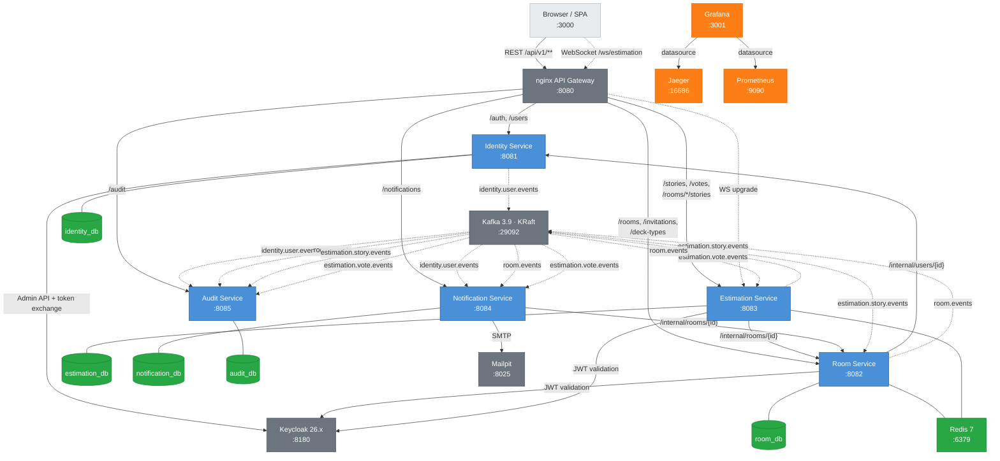

# Planning Poker Platform

A real-time collaborative estimation tool for agile teams, built with a microservices architecture.

Five Spring Boot 4.x services communicate through Kafka events and REST, with Keycloak handling identity, Redis powering caching, and STOMP/SockJS delivering real-time voting over WebSocket -- all orchestrated behind an nginx API gateway and launched with a single `docker compose up --build`.

---

## Quick Start

### Prerequisites

| Requirement | Minimum |
|---|---|
| Docker & Docker Compose | v2.20+ |
| Free ports | 3000, 3001, 5432, 6379, 8025, 8080, 8180, 9090, 16686, 29092 |
| RAM | 8 GB recommended (15 containers) |

### Launch

```bash
# 1. Clone the repository
git clone <repo-url> && cd planning-poker

# 2. Copy environment file
cp .env.example .env

# 3. Start the full stack (~15 containers)
docker compose up --build

# First start takes 3-5 minutes (Maven builds + Keycloak realm import).
# Subsequent starts are much faster thanks to layer caching.

# 4. Verify all services are healthy
docker compose ps
```

### Available URLs

| URL | Service | Credentials |
|---|---|---|
| http://localhost:3000 | Frontend SPA | -- |
| http://localhost:8080/api/v1 | API Gateway | Bearer token |
| http://localhost:8180 | Keycloak Admin Console | `admin` / `admin` |
| http://localhost:8025 | Mailpit (email inbox) | -- |
| http://localhost:16686 | Jaeger Tracing UI | -- |
| http://localhost:9090 | Prometheus | -- |
| http://localhost:3001 | Grafana Dashboards | `admin` / `admin` |
| localhost:29092 | Kafka (external) | -- |

### Teardown

```bash
# Stop containers
docker compose down

# Stop and remove all data volumes
docker compose down -v
```

---

## Architecture



**Legend**: Solid arrows = synchronous REST. Dashed arrows = async Kafka / OTLP traces. Dotted arrows = WebSocket (STOMP/SockJS).

---

## Tech Stack

| Technology | Version | Purpose |
|---|---|---|
| Java | 21 (Temurin) | Language runtime |
| Spring Boot | 4.0.0 | Application framework |
| PostgreSQL | 16 | Relational database (5 logical databases) |
| Apache Kafka | 3.9.0 (KRaft) | Async inter-service events (no Zookeeper) |
| Redis | 7 | Caching, rate limiting, active room state |
| Keycloak | 26.0.7 | OIDC identity provider, social login |
| nginx | 1.27 | API gateway, reverse proxy, CORS |
| React | 19 | Frontend SPA |
| STOMP/SockJS | -- | Real-time WebSocket voting |
| Testcontainers | 1.20.4 | Integration test infrastructure |
| ArchUnit | 1.3.0 | Architecture rule enforcement |
| jqwik | 1.9.2 | Property-based testing |
| JaCoCo | 0.8.12 | Code coverage (70% minimum) |
| SpringDoc OpenAPI | 2.8.4 | Swagger UI / API docs |
| Jaeger | latest | Distributed tracing (OTLP) |
| Prometheus | 2.53.0 | Metrics collection |
| Grafana | 11.1.0 | Dashboards and visualization |
| Mailpit | 1.21 | Local email testing |
| Maven | Multi-module POM | Build system |

---

## Services

| Service | Container | Port | Database | Purpose |
|---|---|---|---|---|
| API Gateway | `pp-gateway` | 8080 | -- | Routing, CORS, WebSocket proxy, blocks `/internal/**` |
| Identity Service | `pp-identity` | 8081 | `identity_db` | Users, auth, Keycloak sync, JWT tokens |
| Room Service | `pp-room` | 8082 | `room_db` | Rooms, deck types, invitations, participants |
| Estimation Service | `pp-estimation` | 8083 | `estimation_db` | Stories, voting rounds, real-time WebSocket |
| Notification Service | `pp-notification` | 8084 | `notification_db` | Email delivery (Mailpit), in-app notifications |
| Audit Service | `pp-audit` | 8085 | `audit_db` | Event-sourced CUD audit trail from Kafka |
| Frontend | `pp-frontend` | 3000 | -- | React 19 SPA |

### Kafka Topics

| Topic | Producer | Consumers |
|---|---|---|
| `identity.user.events` | Identity Service | Notification, Audit |
| `room.events` | Room Service | Notification, Audit, Estimation |
| `estimation.story.events` | Estimation Service | Audit, Room |
| `estimation.vote.events` | Estimation Service | Notification, Audit |

All events use a JSON envelope with `eventId`, `eventType`, `timestamp`, `correlationId`, and `payload`. Failed messages route to dead-letter topics with `{topic}.DLT` naming. Consumers are idempotent (deduplication by `eventId`).

---

## API Endpoints

All public endpoints are accessed through the API Gateway at `http://localhost:8080`.

### Getting a Token

```bash
# Get an access token from Keycloak (Resource Owner Password Grant for dev)
TOKEN=$(curl -s -X POST "http://localhost:8180/realms/planning-poker/protocol/openid-connect/token" \
  -H "Content-Type: application/x-www-form-urlencoded" \
  -d "grant_type=password" \
  -d "client_id=planning-poker-spa" \
  -d "username=admin" \
  -d "password=changeme" | jq -r '.access_token')
```

### Identity Service -- Auth & Users

| Method | Path | Auth | Description |
|---|---|---|---|
| `POST` | `/api/v1/auth/register` | No | Register a new user (auto-login) |
| `POST` | `/api/v1/auth/login` | No | Authenticate with username/password |
| `POST` | `/api/v1/auth/refresh` | No | Exchange refresh token for new tokens |
| `POST` | `/api/v1/auth/logout` | No | Invalidate refresh token |
| `GET` | `/api/v1/auth/me` | JWT | Get current user profile |
| `GET` | `/api/v1/users/me` | JWT | Get current user profile |
| `GET` | `/api/v1/users` | JWT (Admin) | List all users (paginated) |
| `PUT` | `/api/v1/users/{keycloakId}` | JWT (Admin) | Update user profile |
| `DELETE` | `/api/v1/users/{keycloakId}` | JWT (Admin) | Deactivate user (soft-delete) |

### Room Service -- Rooms, Decks, Invitations

| Method | Path | Auth | Description |
|---|---|---|---|
| `POST` | `/api/v1/rooms` | JWT | Create a new room (caller is moderator) |
| `GET` | `/api/v1/rooms` | JWT | List rooms (admin: all; user: own) |
| `GET` | `/api/v1/rooms/{id}` | JWT | Get room by ID |
| `PUT` | `/api/v1/rooms/{id}` | JWT (Mod) | Update room |
| `DELETE` | `/api/v1/rooms/{id}` | JWT (Mod/Admin) | Delete room |
| `POST` | `/api/v1/rooms/{id}/join` | JWT | Join room by UUID |
| `POST` | `/api/v1/rooms/join/{shortCode}` | JWT | Join room by short code |
| `GET` | `/api/v1/rooms/{id}/participants` | JWT | List room participants |
| `DELETE` | `/api/v1/rooms/{roomId}/participants/{userId}` | JWT (Mod) | Remove participant |
| `POST` | `/api/v1/rooms/{id}/invite` | JWT (Mod) | Invite user to room |
| `POST` | `/api/v1/rooms/{id}/share-link` | JWT (Mod) | Generate shareable link |
| `GET` | `/api/v1/deck-types` | JWT | List all deck types |
| `POST` | `/api/v1/deck-types` | JWT | Create custom deck type |
| `POST` | `/api/v1/invitations/{token}/accept` | JWT | Accept an invitation |

### Estimation Service -- Stories, Voting, WebSocket

| Method | Path | Auth | Description |
|---|---|---|---|
| `POST` | `/api/v1/stories` | JWT (Mod) | Create a new story |
| `GET` | `/api/v1/stories/{id}` | JWT | Get story by ID |
| `PUT` | `/api/v1/stories/{id}` | JWT (Mod) | Update story |
| `DELETE` | `/api/v1/stories/{id}` | JWT (Mod) | Delete story |
| `GET` | `/api/v1/rooms/{roomId}/stories` | JWT | List stories in a room |
| `PATCH` | `/api/v1/rooms/{roomId}/stories/reorder` | JWT (Mod) | Reorder stories |
| `POST` | `/api/v1/stories/{storyId}/voting/start` | JWT (Mod) | Start voting round |
| `POST` | `/api/v1/stories/{storyId}/voting/finish` | JWT (Mod) | Finish voting, get results |
| `POST` | `/api/v1/stories/{storyId}/votes` | JWT | Submit or replace a vote |
| `GET` | `/api/v1/stories/{storyId}/votes` | JWT | Get votes (after voting finishes) |

**WebSocket** (STOMP over SockJS): `ws://localhost:8080/ws/estimation`
- Subscribe: `/topic/room.{roomId}` -- receive voting events for a room
- Send: `/app/vote` -- submit vote via WebSocket
- Auth: JWT in STOMP `CONNECT` frame header

### Notification Service

| Method | Path | Auth | Description |
|---|---|---|---|
| `GET` | `/api/v1/notifications` | JWT | List notifications (paginated) |
| `PUT` | `/api/v1/notifications/{id}/read` | JWT | Mark notification as read |
| `PUT` | `/api/v1/notifications/read-all` | JWT | Mark all as read |
| `GET` | `/api/v1/notifications/unread-count` | JWT | Get unread count |

### Audit Service (Admin only)

| Method | Path | Auth | Description |
|---|---|---|---|
| `GET` | `/api/v1/audit` | JWT (Admin) | List audit entries (filterable, paginated) |
| `GET` | `/api/v1/audit/{id}` | JWT (Admin) | Get audit entry by ID |
| `GET` | `/api/v1/audit/entity/{entityType}/{entityId}` | JWT (Admin) | Get entity audit history |

### Internal Endpoints (service-to-service only, blocked at gateway)

| Method | Path | Service | Description |
|---|---|---|---|
| `GET` | `/internal/users/{id}` | Identity | Lookup user by UUID |
| `GET` | `/internal/rooms/{id}` | Room | Lookup room by UUID |
| `GET` | `/internal/rooms/{id}/participants` | Room | List room participants |

<details>
<summary><strong>Curl Examples</strong></summary>

```bash
# Sync current user (creates or updates from JWT claims)
curl -X POST http://localhost:8080/api/v1/auth/sync \
  -H "Authorization: Bearer $TOKEN"

# Get current user profile
curl http://localhost:8080/api/v1/users/me \
  -H "Authorization: Bearer $TOKEN"

# Create a room
curl -X POST http://localhost:8080/api/v1/rooms \
  -H "Authorization: Bearer $TOKEN" \
  -H "Content-Type: application/json" \
  -d '{"name": "Sprint 42 Planning", "deckTypeId": "<uuid>"}'

# List my rooms
curl http://localhost:8080/api/v1/rooms \
  -H "Authorization: Bearer $TOKEN"

# Get available deck types
curl http://localhost:8080/api/v1/deck-types \
  -H "Authorization: Bearer $TOKEN"

# Create a story in a room
curl -X POST "http://localhost:8080/api/v1/rooms/<roomId>/stories" \
  -H "Authorization: Bearer $TOKEN" \
  -H "Content-Type: application/json" \
  -d '{"title": "User can reset password", "description": "As a user..."}'

# Cast a vote
curl -X POST http://localhost:8080/api/v1/votes \
  -H "Authorization: Bearer $TOKEN" \
  -H "Content-Type: application/json" \
  -d '{"storyId": "<uuid>", "value": "8"}'

# Get my notifications
curl http://localhost:8080/api/v1/notifications \
  -H "Authorization: Bearer $TOKEN"

# Query audit trail (ADMIN role required)
curl "http://localhost:8080/api/v1/audit?entityType=ROOM&from=2026-01-01" \
  -H "Authorization: Bearer $TOKEN"
```
</details>

---

## Design Decisions

All architecture decisions are documented as ADRs. Click to expand.

<details>
<summary><strong>ADR-001: Microservices Architecture (over Modular Monolith)</strong></summary>

**Context**: The project spec explicitly prefers microservices and awards points for independent deploys, clear contracts, and resilience.

**Decision**: Five services aligned to bounded contexts (Identity, Room, Estimation, Notification, Audit) plus an API Gateway.

**Trade-off**: Higher operational complexity. Mitigated by mono-repo, shared tooling, docker-compose, and Kafka for async communication.
</details>

<details>
<summary><strong>ADR-002: Mono-Repo with Maven Multi-Module</strong></summary>

**Context**: Small team, 7-day timeline, need for atomic cross-service changes and shared kernel.

**Decision**: Single repository with Maven multi-module POM. Each service is an independent subproject with its own Dockerfile. `shared-kernel` provides common DTOs, event contracts, and exception handling.

**Trade-off**: Larger repo, but simpler CI/CD, atomic commits across services, and shared dependency management.
</details>

<details>
<summary><strong>ADR-003: Keycloak as Identity Provider (OIDC)</strong></summary>

**Context**: Spec requires Google/Facebook OIDC and user management synced with an IdP.

**Decision**: Keycloak 26.0.7 with realm export for reproducible setup. Realm auto-imported on first start via `keycloak-init` container that also configures protocol mappers and creates the platform admin user.

**Trade-off**: Heavy infrastructure component (~400 MB image), but eliminates all custom auth code and provides production-ready social login.
</details>

<details>
<summary><strong>ADR-004: Kafka for Inter-Service Event-Driven Communication</strong></summary>

**Context**: Need async communication for notifications, audit trail, and eventual consistency.

**Decision**: Apache Kafka in KRaft mode (no Zookeeper) with 4 topics aligned to bounded contexts. JSON Schema envelope with idempotent consumers and dead-letter topics (DLT).

**Trade-off**: Operational overhead of Kafka. Justified by append-only audit trail, event replay capability, and fully decoupled services.
</details>

<details>
<summary><strong>ADR-005: Database-per-Service with PostgreSQL</strong></summary>

**Context**: Microservices standard mandates data isolation. No cross-service JOINs.

**Decision**: 5 PostgreSQL logical databases (`identity_db`, `room_db`, `estimation_db`, `notification_db`, `audit_db`), one per service. Flyway migrations per service. Each database has its own schema matching the service name.

**Trade-off**: No cross-service JOINs. Mitigated by event-driven data replication where needed and internal REST endpoints for lookups.
</details>

<details>
<summary><strong>ADR-006: nginx as API Gateway</strong></summary>

**Context**: Need a single entry point for all external traffic with JWT forwarding, CORS, and WebSocket proxying.

**Decision**: nginx 1.27-alpine as reverse proxy. Zero business logic; configuration-only. Blocks `/internal/**` routes. Injects `X-Correlation-Id` headers.

**Trade-off**: No built-in service discovery (uses Docker Compose DNS). No circuit breaking at gateway level (handled by Resilience4j in services). Simple, fast, and minimal resource usage.
</details>

<details>
<summary><strong>ADR-007: Redis for Caching & Rate Limiting</strong></summary>

**Context**: Real-time voting needs fast reads; API Gateway needs rate limiting.

**Decision**: Redis 7 for active room state (TTL 2h), vote aggregation, rate limiting, and session data. Used by Room and Estimation services.

**Trade-off**: Additional infrastructure. Justified by sub-millisecond latency for real-time voting features.
</details>

<details>
<summary><strong>ADR-008: STOMP over SockJS for Real-Time Voting</strong></summary>

**Context**: Real-time vote counting and result broadcasting require push from server to client.

**Decision**: STOMP protocol over SockJS in Estimation Service. JWT auth in STOMP `CONNECT` frame. Proxied through nginx gateway with WebSocket upgrade and 24-hour read timeout.

**Trade-off**: WebSocket adds complexity. Justified by core product requirement -- users must see votes appear in real-time without polling.
</details>

<details>
<summary><strong>ADR-009: Clean Architecture (Ports & Adapters) per Service</strong></summary>

**Context**: Each service needs testable, framework-independent business logic.

**Decision**: Hexagonal Architecture within each service: `domain` (entities, value objects, ports), `application` (use cases), `infrastructure` (JPA adapters, Kafka, config), `web` (controllers, DTOs, mappers).

**Trade-off**: More boilerplate per service. Justified by testability (domain logic has zero Spring dependencies) and enforced by ArchUnit rules.
</details>

<details>
<summary><strong>ADR-010: UUID Primary Keys (BIGSERIAL for Audit)</strong></summary>

**Context**: Distributed services need safe ID generation without coordination.

**Decision**: UUID PKs for all domain tables (generated in application layer). BIGSERIAL for `audit_entries` (append-only, high-throughput).

**Trade-off**: UUID indexes are larger than BIGINT. Acceptable at this scale; BIGSERIAL audit exception avoids UUID overhead on the highest-write table.
</details>

---

## Development

### Project Structure

```
planning-poker/
├── shared-kernel/              # Shared DTOs, event contracts, exceptions
├── identity-service/           # Auth, users, Keycloak sync
├── room-service/               # Rooms, decks, invitations, participants
├── estimation-service/         # Stories, voting, WebSocket
├── notification-service/       # Email, in-app notifications
├── audit-service/              # Event-sourced audit trail
├── test-fixtures/              # Shared test helpers & builders
├── frontend/                   # React 19 SPA
├── infra/{gateway,keycloak,postgres,prometheus,grafana}/
├── postman/                    # Postman collection
├── docker-compose.yml          # Full stack (15 containers)
├── docker-compose.infra.yml    # Infrastructure only
├── docker-compose.integration.yml
├── pom.xml                     # Parent POM (multi-module)
└── .env.example                # Environment variable template
```

Each service follows Clean Architecture (Hexagonal): `domain` (entities, ports) / `application` (use cases, inbound/outbound ports) / `infrastructure` (JPA, Kafka, config) / `web` (controllers, DTOs).

### Running Tests

```bash
./mvnw verify                              # All tests (unit + integration)
./mvnw verify -pl identity-service         # Single service
./mvnw test                                # Unit tests only (fast, no containers)
./mvnw verify jacoco:report                # Generate coverage report
./mvnw test -Dtest="*ArchitectureTest"     # ArchUnit layer enforcement
# Coverage reports: <service>/target/site/jacoco/index.html
```

Coverage threshold: **70%** instruction coverage per service (enforced in CI). `shared-kernel` and `test-fixtures` are excluded.

### Running Infrastructure Only

```bash
docker compose -f docker-compose.infra.yml up -d   # Databases, Kafka, Redis, Keycloak, observability
./mvnw spring-boot:run -pl identity-service -Dspring-boot.run.profiles=local  # Run one service locally
```

<details>
<summary><strong>Adding a New Service</strong></summary>

1. Create Maven module directory, add to parent `pom.xml` `<modules>`
2. Copy `Dockerfile` from existing service
3. Add Flyway migrations at `src/main/resources/db/migration/`
4. Add logical database to `infra/postgres/init-databases.sh`
5. Add service to `docker-compose.yml` and nginx routes in `infra/gateway/nginx.conf`
6. Register Kafka consumer groups if applicable
7. Add to CI matrix in `.github/workflows/ci.yml`
</details>

### Environment Variables

All configuration is in `.env` (copied from `.env.example`). Key defaults: PostgreSQL (`ppuser`/`pppass`), Redis (`redispass`), Keycloak admin (`admin`/`admin`), platform admin (`admin`/`changeme`), Grafana (`admin`/`admin`). Override ports via `GATEWAY_PORT`, `KC_PORT`, etc. See `.env.example` for the complete list.

---

## Observability

All services export OpenTelemetry traces and Prometheus metrics.

| Tool | URL | Purpose |
|---|---|---|
| **Jaeger** | http://localhost:16686 | Distributed tracing -- search by service, trace ID, or operation |
| **Prometheus** | http://localhost:9090 | Metrics -- scrapes `/actuator/prometheus` per service |
| **Grafana** | http://localhost:3001 | Dashboards -- pre-provisioned datasources for Prometheus and Jaeger |

Services send OTLP traces to Jaeger on ports `4317` (gRPC) and `4318` (HTTP). The nginx gateway injects `X-Correlation-Id` for end-to-end trace correlation. Alert rules are defined in `infra/prometheus/alerts.yml`. Every container has a Docker health check (`docker compose ps`). Services expose `/actuator/health/liveness` and `/actuator/health/readiness`.

---

## CI/CD

GitHub Actions (`.github/workflows/ci.yml`) runs on every push and PR to `main`: **Build & Test** (`mvn verify -B`, JaCoCo >= 70%) / **SonarQube** (static analysis + quality gate) / **Docker Build** (per-service images to GHCR + Trivy scan, `main` only) / **Integration Test** (full docker-compose E2E, `main` only).

---

## Troubleshooting

| Problem | Symptom | Fix |
|---|---|---|
| **Keycloak won't start** | `pp-keycloak` exits, `keycloak-init` connection refused | `docker compose down -v && docker compose up --build` |
| **Kafka timeout** | `TimeoutException` in service logs | Kafka needs ~25s to init (KRaft). Verify: `docker compose exec kafka /opt/kafka/bin/kafka-topics.sh --bootstrap-server localhost:9092 --list` |
| **Port conflict** | `Bind for 0.0.0.0:8080: address already in use` | Override in `.env`: `GATEWAY_PORT=9080`, `KC_PORT=9180`, etc. |
| **Flyway validation** | `FlywayException: Validate failed` | `docker compose down -v && docker compose up --build` (destroys data) |
| **WebSocket drops** | STOMP closes after CONNECT | Verify JWT in STOMP CONNECT headers. Check: `docker compose logs estimation-service --tail=50` |
| **CI coverage fail** | JaCoCo threshold check fails | Run `./mvnw verify jacoco:report -pl <service>`, open `target/site/jacoco/index.html`. Threshold: 70%. |

---

## License

This project is a candidate assessment submission and is not licensed for redistribution.
